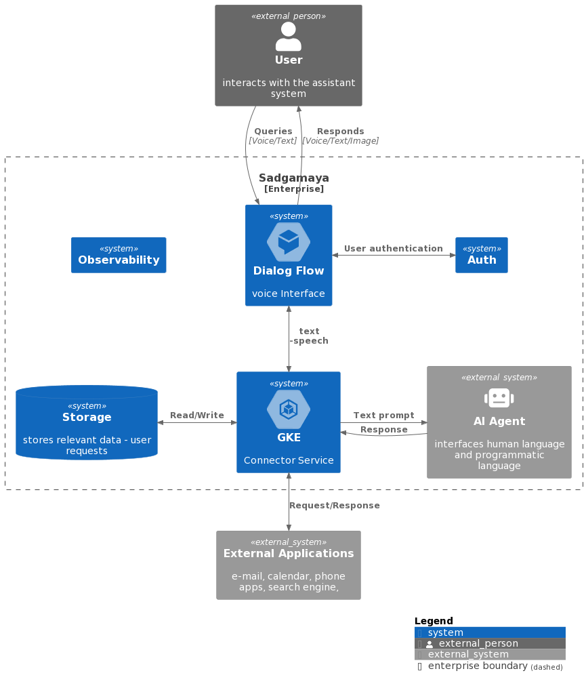

# System Documentation

You find detailed documentation of the development aspects of the project here.
## Overview of the project and its requirements

C1 level overview of the project

---

C2 Level overview

## Detailed description of the tools and technologies used
---

Initial goal of the project is to integrate DialogFlow and ChatGPT, using NodeJS containers on Kubernetes as middleware.

A desirable feature is to save user conversations in database and recall them when the user logs back

NodeJS
Yarn
## Branching strategy

## Steps for setting up the development environment and configuring Google Cloud Platform services
---
## Best practices for code development, testing, and deployment
---
## Strategies for monitoring and troubleshooting the application
---
## Security best practices implemented in the project
---
## Any other relevant information that would be helpful for users or contributors

